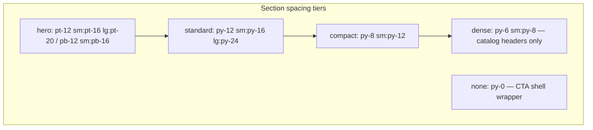

# Section Gap Consistency — Audit and Remediation Plan

## Canonical rules (source of truth)

From `[DOC/PROJECT PLAN/Frontend/01-design-system.md](DOC/PROJECT PLAN/Frontend/01-design-system.md)`:


| Breakpoint | Section padding (each side) |
| ---------- | --------------------------- |
| Mobile     | 48px (`py-12`)              |
| Tablet     | 64px (`py-16`)              |
| Desktop    | 96px (`py-24`)              |


Allowed spacing scale: **4, 8, 12, 16, 24, 32, 48, 64, 96** only.

Current `[Section](web/src/components/primitives/Container.tsx)` default:

```tsx
"py-16 sm:py-20 lg:py-24"; // 64 / 80 / 96 — already wrong on mobile + tablet vs doc
```

### Real-world layout logic (what premium marketing sites do)

1. **One vertical rhythm token set** — pages should not invent per-route padding.
2. **Boundary gap = one rhythm unit** — gap between Section A content and Section B content should be ~48–96px, not 128–192px from stacked `py-` on both sections.
3. **Hero is a tier, not a snowflake** — top breathing room for header; bottom transitions into first content band with *slightly less* than standard section padding.
4. **Dense/toolbar bands are intentional** — catalog filters, tab bars, trust strips use a *compact* tier, not random `py-4`/`py-8`.
5. **Same-tone adjacent sections should merge visually** — two consecutive `tone="inset"` blocks should not look like one band with a crater in the middle.
6. **CTA bands carry their own padding** — outer `Section` should not add full rhythm *around* an already-padded dark slab (`[CTABand.tsx](web/src/components/sections/CTABand.tsx)` line 22–24).




---

## Root causes (systemic)


| Issue                                      | Impact                                                                                                                                      |
| ------------------------------------------ | ------------------------------------------------------------------------------------------------------------------------------------------- |
| `Section` default ≠ design doc             | Mobile uses 64px not 48px; tablet uses 80px not 64px                                                                                        |
| 40+ manual `className` overrides           | Same page types use different gaps (`py-10`, `py-14`, `pb-20`, `pb-24`)                                                                     |
| Stacked section padding doubles boundaries | Default + default = 128px mobile / 192px desktop between content                                                                            |
| Non-`Section` strips (`TrustBar`, tabs)    | Insert ad-hoc `py-6`/`py-4` bands that break rhythm                                                                                         |
| Mid-page “second heroes” on Home           | `[HtmlBusinessProfilesCategoryHero](web/src/components/sections/HtmlBusinessProfilesCategoryHero.tsx)` repeats full hero spacing mid-scroll |
| Product detail mega-page                   | `[shop/[slug]/page.tsx](web/src/app/shop/[slug]/page.tsx)` has 10+ custom `py-10`/`border-t` sections                                       |
| Off-scale values                           | `py-10` (40px), `py-14` (56px), `sm:py-20` (80px), `pb-20` (80px) not in allowed scale                                                      |


---

## Page-by-page findings (public marketing surface)

### Critical — highest inconsistency

`**[/](web/src/app/page.tsx)` (Home)

- Hero: `pb-20` (80px, off-scale) vs peers using `pb-12`–`pb-16`
- `[WebsiteTemplateHtmlPreviewShowcaseSections](web/src/components/sections/WebsiteTemplateHtmlPreviewShowcaseSections.tsx)`: `pt-10 pb-8` + `py-10 sm:py-12` — two compact scales in a row
- Mid-page `[HtmlBusinessProfilesCategoryHero](web/src/components/sections/HtmlBusinessProfilesCategoryHero.tsx)`: full hero spacing again (`pt-12 pb-14 sm:pt-16 sm:pb-16`) — reads like a second page top
- `[TrustBar](web/src/components/marketing/TrustBar.tsx)`: `py-6` strip between inset/standard sections — asymmetric gap above vs below
- `[FeaturedProducts](web/src/components/marketing/FeaturedProducts.tsx)`: `py-10 sm:py-14` (off-scale 56)
- `[ServiceCards](web/src/components/marketing/ServiceCards.tsx)`: `py-16 sm:py-20` while adjacent `[ThreePathExplainer](web/src/components/marketing/ThreePathExplainer.tsx)` uses default — back-to-back inset with different padding
- `[CTABand](web/src/components/sections/CTABand.tsx)`: wrapped in full `Section` → extra 64–96px above/below the CTA card

`**[/products/` shop detail](web/src/app/shop/[slug]/page.tsx)

- Repeating pattern `py-10 sm:py-12` + `border-t` across many bands — consistent *within page* but wrong tier vs rest of site
- Hero bands `pt-6 pb-10` — unique “product detail” dialect
- Same inset + border-t combos create uneven visual weight between FAQ, highlights, comparison tables

`**[/pricing](web/src/app/pricing/PricingPageClient.tsx)`

- Tab strip `py-4` (16px) sandwiched between hero and tiers — feels cramped vs 48px+ neighbors
- Tier grid `py-8` then **three consecutive** `tone="inset"` sections — triple inset stack with full doubled padding at each boundary

### High — hero tier fragmentation

Same page type, different hero bottom padding:


| Pattern                                          | Pages                                     |
| ------------------------------------------------ | ----------------------------------------- |
| `pb-12`                                          | Contact, FAQ, Portfolio list, Pricing     |
| `pb-14`                                          | Services index, Additional services       |
| `pb-16`                                          | About, Services slug                      |
| `pb-10`                                          | Blog index                                |
| `pb-8`                                           | AI Concierge                              |
| `pb-20`                                          | **Home only**                             |
| `pb-24` + `pt-16 sm:pt-24`                       | Book appointment, Not found, Coming soon  |
| **No bottom override** (inherits `py-16` bottom) | **Solutions x4** — largest accidental gap |


Hero top is mostly `pt-12 sm:pt-16` except oversized utility pages (`pt-16 sm:pt-24`).

### Medium — compact/content pages


| Route                                                         | Issue                                                                                                                               |
| ------------------------------------------------------------- | ----------------------------------------------------------------------------------------------------------------------------------- |
| `[/products](web/src/app/shop/page.tsx)`                      | Catalog header `pt-10 pb-6 sm:pt-14` + grid `py-8 sm:py-12` — acceptable *dense* pattern but undocumented; not using shared variant |
| `[/portfolio](web/src/app/portfolio/PortfolioPageClient.tsx)` | Filter band `py-8` then grid `py-16` (no responsive sm/lg steps)                                                                    |
| `[/blog](web/src/app/blog/page.tsx)`                          | Hero `pb-10`; listing `py-12` shrinks below default                                                                                 |
| `[/blog/[slug]](web/src/app/blog/[slug]/page.tsx)`            | Split hero `pb-0 pt-8` + article `pt-12 pb-8` — intentional overlap but unique                                                      |
| `[/contact](web/src/app/contact/page.tsx)`                    | Channels bridge `py-8` between hero and form                                                                                        |
| `[/faq](web/src/app/faq/FaqPageClient.tsx)`                   | Quick answers `py-12` duplicates hero-adjacent compact need                                                                         |
| Legal pages                                                   | 3-step ladder `pb-8` → `py-8` → `py-12` — fine for docs if standardized as `legal` tier                                             |


### Lower — mostly consistent alternating pattern

These follow **hero → inset → default → inset** reasonably but still suffer from doubled boundary padding:

- `[/about](web/src/app/about/page.tsx)`
- `[/services](web/src/app/services/page.tsx)`
- `[/services/[slug]](web/src/app/services/[slug]/page.tsx)` (one `py-12` outlier block)
- `[/additional-services](web/src/app/additional-services/page.tsx)`
- Category landings: `[WebsiteTemplatesCategoryLanding](web/src/components/sections/WebsiteTemplatesCategoryLanding.tsx)`, `[HtmlBusinessProfilesCategoryLanding](web/src/components/sections/HtmlBusinessProfilesCategoryLanding.tsx)`, `[WebsiteTemplatesHtmlPreviewCategoryLanding](web/src/components/sections/WebsiteTemplatesHtmlPreviewCategoryLanding.tsx)` — structurally aligned but use mixed `py-10 sm:py-14` / `py-14 sm:py-16` on pricing blocks

### Utility/auth (out of marketing rhythm — document separately)

Checkout, login, dashboard, admin, success, live-chat, global-error — various `py-16 sm:py-24`; lower priority unless you want one `utility-page` tier.

---

## Recommended spacing contract (to implement)

Extend `Section` in `[Container.tsx](web/src/components/primitives/Container.tsx)`:

```tsx
type SectionSize = "hero" | "standard" | "compact" | "dense" | "none";

const sectionSizeClass: Record<SectionSize, string> = {
  hero: "pt-12 sm:pt-16 lg:pt-20 pb-12 sm:pb-16",
  standard: "py-12 sm:py-16 lg:py-24", // matches design doc
  compact: "py-8 sm:py-12", // tabs, filters, bridges
  dense: "py-6 sm:py-8", // catalog page headers only
  none: "py-0",
};
```

Optional: `spacing="split"` mode using `pt-*` / `pb-*` only on first/last sections per page to fix doubled gaps (or a `PageStack` wrapper with `gap-y-12 sm:gap-y-16 lg:gap-y-24` and sections use `py-0`).

**CTABand:** change outer wrapper to `<Section size="compact">` or `size="none"` with inner card keeping `py-14 sm:py-16`.

**TrustBar / trust strips:** promote to `Section size="compact" tone="inset"` or shared `TrustBarBand` component — not raw `py-6` div.

---

## Remediation phases

### Phase 1 — Fix the primitive (highest leverage)

- Align `Section` default to design doc values
- Add `size` prop; deprecate ad-hoc `py-` overrides in new work
- Document tiers in `[01-design-system.md](DOC/PROJECT PLAN/Frontend/01-design-system.md)` and `[02-component-system.md](DOC/PROJECT PLAN/Frontend/02-component-system.md)`

### Phase 2 — Normalize heroes (15 files)

- Apply `size="hero"` everywhere with `hero-section` class
- Fix Solutions pages missing bottom override (currently largest gap bug)
- Downgrade Book appointment / Not found / Coming soon from `pb-24` to standard hero unless intentionally “empty state”

### Phase 3 — Home page rhythm (worst offender)

- Collapse preview showcase + mobile preview into one `standard` section or two `compact` sections
- Replace mid-page `HtmlBusinessProfilesCategoryHero` with `compact` spotlight (no second hero)
- Normalize FeaturedProducts / ServiceCards / ThreePathExplainer to same inset tier
- Fix CTABand outer padding

### Phase 4 — Catalog & product detail

- Shop index: `dense` header + `compact` grid section
- Product detail: replace repeated `py-10 sm:py-12 border-t` with `compact` + shared divider token

### Phase 5 — Pricing, portfolio, blog, contact, FAQ

- Pricing tabs: `compact`; tiers: `standard`; merge or half-pad consecutive inset blocks
- Portfolio filter: `compact`; grid: `standard`
- Blog/contact/FAQ: unify hero + first content band gaps

### Phase 6 — Validation

- Visual pass at 375 / 768 / 1280 on Home, Products, Product detail, Pricing, Services, About
- Measure inter-section gaps (target: 48/64/96px between content, not 2x)
- Update `[home-page.md](DOC/PROJECT PLAN/Frontend/home-page.md)` and related page plans with section size map

---

## Priority matrix


| Priority | Route / area                  | Primary gap issue                                   |
| -------- | ----------------------------- | --------------------------------------------------- |
| P0       | `Section` primitive           | Default ≠ design doc; no variants                   |
| P0       | Home `/`                      | 3 hero-scale blocks + TrustBar + CTABand double pad |
| P1       | Solutions x4                  | Hero inherits full bottom padding                   |
| P1       | Pricing                       | `py-4` tab strip; triple inset stack                |
| P1       | Product detail                | Parallel spacing dialect                            |
| P2       | Category landings (x3)        | Mixed `py-10`/`py-14` on same section types         |
| P2       | Portfolio, Blog, Contact, FAQ | Hero bottom + bridge section drift                  |
| P3       | Legal, utility pages          | Document `legal`/`utility` tier                     |


---

## Relationship to scroll-header plan

The [scroll-aware header plan](c:\Users\User.cursor\plans\scroll-aware_header_chrome_ab2e8861.plan.md) is independent. Hero top padding (`pt-12 sm:pt-16 lg:pt-20`) already accounts for fixed/sticky chrome — keep that when implementing both plans.

---

## Out of scope (this pass)

- Color, typography, component styling inconsistencies
- Horizontal gutters (Container already consistent)
- Admin/dashboard surfaces
- HTML template sites in `sites/`

