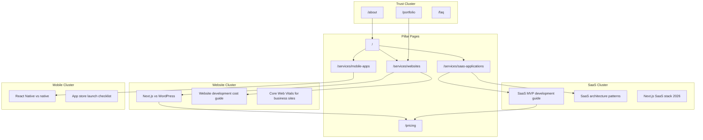

# Content Strategy Roadmap — Growrix OS

Document status: active
Last updated: 2026-07-15
Project / lane: `web/`
Mode: Content Strategy Mode
Agent: On_Page_SEO_expert

---

## Objective

Build topical authority and lead-gen traffic for **custom website, SaaS, and mobile app development** while keeping digital products and automation as secondary conversion paths.

## Audience

- Founders and product leaders (global, English-speaking)
- SMB operators needing production-ready web/SaaS/mobile delivery
- Agencies evaluating white-label or template accelerators

## Topic Cluster Map

## Pillar Content Plan

| Pillar URL | Role | Content depth target | Internal links in |
| --- | --- | --- | --- |
| `/services/websites` | Money page — custom websites | 1,500+ words equivalent (sections) | Homepage, blog cluster, portfolio |
| `/services/saas-applications` | Money page — SaaS | 1,500+ words | Homepage, blog, pricing |
| `/services/mobile-apps` | Money page — mobile | 1,500+ words | Homepage, blog, portfolio |
| `/pricing` | Commercial investigation | Clear tier tables + FAQ | All service pages, blog CTAs |
| `/about` | E-E-A-T / trust | Founder story, process, principles | Homepage, contact, blog author |

## Editorial Calendar (90-day starter)

| Week | Topic | Type | Target keyword | Links to |
| --- | --- | --- | --- | --- |
| 1 | How much does custom website development cost in 2026? | Guide | website development cost | `/pricing`, `/services/websites` |
| 2 | Next.js vs WordPress for business websites | Comparison | Next.js vs WordPress | `/services/websites` |
| 3 | SaaS MVP development: scope, timeline, and budget | Guide | SaaS MVP development | `/services/saas-applications`, `/pricing` |
| 4 | Case study format: [portfolio project] breakdown | Case study | web development portfolio | `/portfolio`, `/contact` |
| 5 | React Native vs native apps for startups | Comparison | React Native vs native | `/services/mobile-apps` |
| 6 | What to expect from a discovery call | FAQ-style | web development consultation | `/book-appointment` |
| 7 | Website templates vs custom build: when to choose each | Comparison | website templates vs custom | `/digital-products`, `/services/websites` |
| 8 | Core Web Vitals checklist before launch | Technical guide | Core Web Vitals checklist | `/services/technical-seo` |
| 9 | Building a SaaS with Next.js and TypeScript | Tutorial | Next.js SaaS tutorial | `/services/saas-applications` |
| 10 | Post-launch support: what good agencies include | Trust | website maintenance support | `/about`, `/faq` |
| 11 | Ready websites vs templates: Growrix delivery models | Product education | ready to launch website | `/digital-products`, `/pricing` |
| 12 | Mobile app launch checklist for founders | Checklist | mobile app launch checklist | `/services/mobile-apps` |

**Cadence:** 1 publish every 1–2 weeks via existing `/blog` (Sanity CMS). Reuse `web/src/lib/blog-landing-content.ts` hero once TXT-020 approved.

## E-E-A-T Plan

| Signal | Current state | Action |
| --- | --- | --- |
| Founder identity | About page with founder photo | Keep prominent; add credentials line (years, stack expertise) after approval |
| Author bylines | Blog supports author | Ensure all posts have named author + date |
| Client proof | Portfolio + testimonials | Curate dev-specific testimonials; deprioritize generic Google Reviews widget |
| Process transparency | Process sections on service pages | Link process from homepage |
| Contact clarity | Contact, book, WhatsApp | Maintain NAP consistency in footer |
| Policies | Privacy, terms, refund | In sitemap (done) |

## Content Pruning / Demotion

| Asset | Action | Rationale |
| --- | --- | --- |
| MCP servers service page | Hide from primary services or merge into Automation | Secondary focus |
| AI concierge homepage section | Demote below fold or shrink | Not primary lead-gen |
| AI concierge footer link | Removed (done) | Reduce nav noise |
| MCP mentions in product/blog copy | Remove when TXT-020/021 approved | Intent alignment |
| Google Reviews widget | Keep gated off unless real dev reviews | Generic reviews weak for B2B dev SEO |

## Measurement Plan

| KPI | Source | Baseline | Target (90 days) |
| --- | --- | --- | --- |
| Impressions (money pages) | GSC | `missing_knowledge` | +30% |
| CTR (homepage, services) | GSC | `missing_knowledge` | +0.5–1.0 pp |
| Organic leads (contact + book) | Analytics | `missing_knowledge` | +20% |
| Blog → service page clicks | GA4 events | `missing_knowledge` | Track after publish |
| Indexed pages | GSC coverage | `missing_knowledge` | No critical errors |

## Handoffs

| Deliverable | Owner |
| --- | --- |
| Blog post drafts | frontend-content-strategist |
| CMS publish + revalidation | senior-frontend-specialist |
| Metadata after copy approval | Technical_SEO_expert |
| Link building for pillar pages | Off_Page_SEO_expert |

## Validation

- [ ] User approves suggested text changes
- [ ] First 4 editorial calendar posts published
- [ ] Internal links from each blog post to one money page minimum
- [ ] GSC baseline captured within 7 days of indexing enabled
